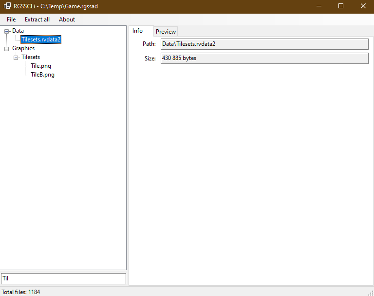

# RGSSGui

Windows desktop application for browsing, extracting, and creating RPG Maker RGSS archives. Built with WPF on .NET 10.



## Requirements

- Windows 10 / 11
- [.NET 10.0 Desktop Runtime](https://dotnet.microsoft.com/download)

## Supported Formats

| File extension | RPG Maker version |
|---------------|-------------------|
| `.rgssad`     | XP                |
| `.rgss2a`     | VX                |
| `.rgss3a`     | VX Ace            |

## Opening an Archive

**From the menu:** `File → Open archive` — choose any supported archive file.

**From the command line:**
```
RGSSGui.exe "C:\Games\RPGMakerGame\Game.rgss3a"
```

**Double-click** — after registering file associations (see below), double-clicking any `.rgssad`, `.rgss2a`, or `.rgss3a` file opens it directly.

**Recent files:** `File → Open Recent` keeps the last 10 opened archives.

## Browsing Files

The left panel shows the archive contents as a hierarchical tree. Folders can be expanded and collapsed individually or all at once via the context menu.

**Filtering:** type a regular expression into the search box at the bottom of the left panel. The tree updates automatically after a short delay. Check the **Not** checkbox to invert the filter and show only files that do *not* match the expression. The **Reset** button clears both the expression and the invert checkbox in one step.

## Selecting Files

| Action | Result |
|--------|--------|
| Click | Select a single file or folder |
| Ctrl + Click | Add or remove from selection |
| Shift + Click | Select a contiguous range |
| Right-click | Open context menu on the current selection |

Selecting a folder includes all files inside it (recursively) for extraction.

## Extracting Files

**Extract all:** `Extract all` menu item — choose an output folder and all files are written there preserving directory structure.

**Extract selection:** right-click the tree, then choose:
- `Extract selected → With folder structure` — preserves paths relative to the archive root
- `Extract selected → Flat (files only)` — writes all files directly into the chosen folder with no subdirectories

A progress dialog appears for multi-file operations and can be cancelled at any time.

## Previewing Files

Select a file and switch to the **Preview** tab on the right panel.

Supported image formats: `.jpg`, `.jpeg`, `.png`, `.gif`, `.bmp`.

| Control | Action |
|---------|--------|
| Mouse wheel | Zoom in / out |
| Left-click drag | Pan the image |
| Double-click | Reset zoom and position |

The zoom range is 0.05× to 20×. Zoom anchors to the cursor position.

## Creating Archives

`File → Create archive → V3` — produces a `.rgss3a` archive (RPG Maker VX Ace).  
`File → Create archive → V1` — produces a `.rgssad` / `.rgss2a` archive (RPG Maker XP / VX).

Select the source folder, then choose the output file location. A progress dialog tracks the operation. The newly created archive opens automatically on completion.

## File Association Registration

`Tools → Register file associations` writes registry entries under `HKEY_CURRENT_USER` (no administrator rights required) so that `.rgssad`, `.rgss2a`, and `.rgss3a` files open with RGSSGui when double-clicked.

The registration uses the path of the currently running executable, so run this step once after moving the application to its final location.

## Status Bar

The status bar at the bottom shows the total number of files in the currently open archive.

## Keyboard Shortcuts

| Shortcut | Action |
|----------|--------|
| Ctrl + Click | Toggle selection |
| Shift + Click | Range selection |
| Mouse wheel (on image) | Zoom |
